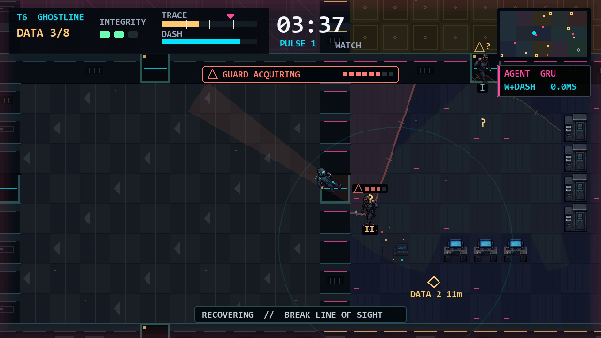
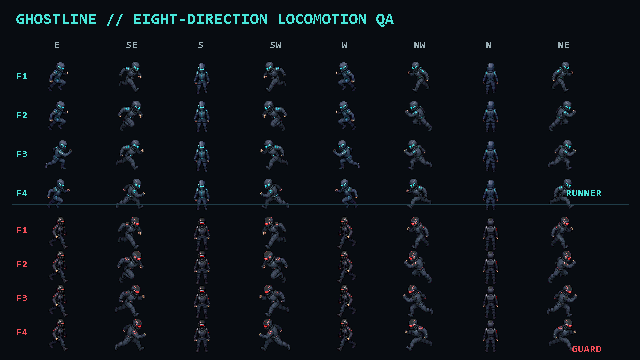
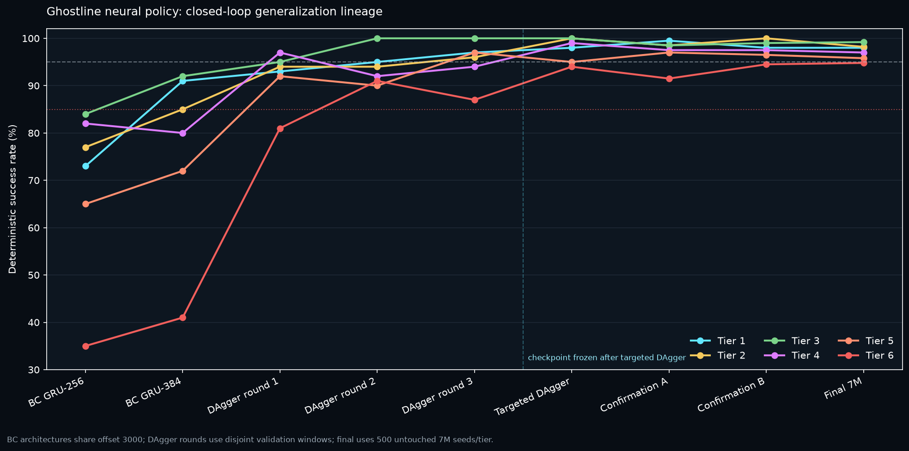
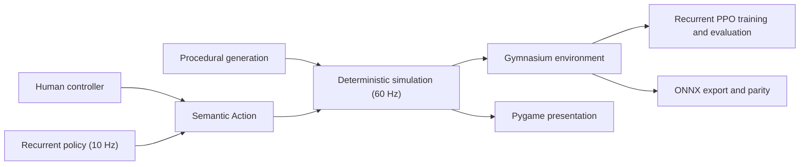

# Ghostline

Ghostline is a procedural 2D stealth-infiltration game and reinforcement-learning benchmark. Steal enough data to satisfy a contract, manage an escalating trace signature, and extract before security closes the route.

The keyboard game, Agent Lab, recurrent policy, evaluation tools, and replay recorder all use the same deterministic 60 Hz headless simulation.

## Measured neural result

The frozen GRU BC+DAgger policy passed its one-time evaluation over 3,000
untouched 7M contracts. Results are tied to environment fingerprint
`17d8617f...3739b`; the final-test ledger is permanently consumed.

| Tier | Target | Success | Wilson 95% | Mean damage | Median time |
|---|---:|---:|---:|---:|---:|
| 1 - Orientation | 95% | 490/500 (98.0%) | 96.36-98.91% | 0.000 | 13.31 s |
| 2 - Surveillance | 95% | 491/500 (98.2%) | 96.61-99.05% | 0.000 | 12.14 s |
| 3 - Patrol | 95% | 496/500 (99.2%) | 97.96-99.69% | 0.236 | 25.61 s |
| 4 - Countermeasure | 95% | 485/500 (97.0%) | 95.11-98.17% | 0.204 | 24.79 s |
| 5 - Lockdown | 95% | 479/500 (95.8%) | 93.66-97.24% | 0.238 | 29.40 s |
| 6 - Ghostline | 85% | 474/500 (94.8%) | 92.49-96.43% | 0.554 | 40.51 s |

[Watch the 30-second tier-6 agent demo](videos/ghostline-demo.mp4). The full
[JSON](benchmarks/neural/champion-final-7m-500.json),
[aggregate CSV](benchmarks/neural/champion-final-7m-500.csv), and
[episode CSV](benchmarks/neural/champion-final-7m-500.episodes.csv) include
exact seeds, action hashes, reward accounting, failures, damage, detections,
trace, time, path efficiency, optional data, and inference latency.

## Gameplay



The shipping view uses a 640×360 logical canvas with exact nearest-neighbour scaling. The world is never washed out by square exploration tiles: camera and guard sight appears as smooth 65-ray, occlusion-correct cones, with dashed electronic scans and notched human-sight boundaries. Suspicion becomes a segmented color-plus-shape meter before confirmed pursuit. Runner and guard locomotion retains all eight travel directions with dedicated four-frame diagonal cycles, while Standard, Interceptor, and Elite patrol badges make the tiered threat curve readable.



## Why it belongs in an RL portfolio

- Six procedural tiers with disjoint training, validation, and final-test seed namespaces.
- Player-equivalent structured sensing: the policy never receives unseen enemy state.
- A universal entity-aware recurrent actor-critic with masked `Discrete(36)` actions and a fair observation-only teacher for BC/DAgger supervision.
- Deterministic replay, exact reward accounting, generation fuzzing, Wilson intervals, and ONNX parity testing.
- A complete playable game with menus, briefings, progression, accessibility settings, procedural audio, Agent Lab, and a packaged Windows build.





## Play

```powershell
py -3.13 -m venv .venv
.\.venv\Scripts\Activate.ps1
python -m pip install --constraint requirements.lock -e .
ghostline play
```

Python 3.13 is the release baseline (3.12-3.14 are supported). The base install
contains only the deterministic game/environment stack. Install
`.[agent]` to enable the selected ONNX policy in Agent Lab, or `.[dev]` for the
test and wheel-building toolchain:

```powershell
python -m pip install --constraint requirements.lock -e ".[agent]"
python -m pip install --constraint requirements.lock -e ".[dev]"
```

Controls:

- `WASD`: move
- `Shift`: energy-limited noisy dash
- `Space`: limited disruption pulse
- `R`: retry the current seed
- `Esc`: pause or go back

Enter an amber terminal ring to link data. Movement inside the ring does not interrupt linking; leaving pauses progress and returning resumes it. After meeting quota, reach the green extraction relay.

## Agent Lab and public environment

```powershell
ghostline lab --tier 6 --seed 2000000
```

```python
import gymnasium as gym
import ghostline

env = gym.make("GhostlineEnv-v2", tier=3, seed=42)
observation, info = env.reset(seed=42)
```

The action space represents `9 movement × 2 dash × 2 pulse` combinations. Observations contain ego state, an explicit player-equivalent objective vector, an egocentric local grid, known targets, shared live/last-seen/quantized-audio security intel, 24 directional rays, confidence masks, and an action mask. The 13-feature entity record includes explicit guard grade; no hidden live coordinate is exposed. Acquire objectives use stable terminal hysteresis and a visible six-tile navigation look-ahead, so the HUD, fair teacher, and neural policy receive the same non-oscillating route signal. `GhostlineEnv-v1` remains registered only as the documented compatibility baseline.

## Training and evaluation

Ghostline uses Python 3.13, Gymnasium 1.3, NumPy 2.5, and PyTorch 2.13 CUDA 13.0. Behavior cloning, DAgger, RND, recurrent PPO/GAE, checkpoint selection, and resume state are implemented directly in PyTorch without an additional RL framework dependency. Training dependencies are isolated from both the base player and the lightweight ONNX agent runtime.

```powershell
python -m pip install --constraint requirements.lock -e ".[train]"
ghostline train --hours 24 --experiment ghostline-universal
# One-shot release audit: run only after validation has selected and frozen the champion.
ghostline evaluate --model models/ghostline-policy.pt --episodes 500 --seed-start 7000000 --slice-manifest benchmarks/final-test-slices.json --output benchmarks/neural/champion-final-7m-500.json
ghostline export --model models/ghostline-policy.pt --output models/ghostline-policy.fp32.onnx --quantize --deployment-output models/ghostline-policy.onnx --parity-samples 1000
Copy-Item models/ghostline-policy.fp32.parity.json benchmarks/neural/champion-onnx-parity.json
python scripts/build_web.py --model models/ghostline-policy.onnx
```

Export always preserves the canonical FP32 graph. With `--quantize`, it also writes a dynamic-INT8 candidate and independently replays both recurrent graphs against PyTorch. `--deployment-output` receives INT8 only after zero deterministic-action mismatches; otherwise it receives the verified FP32 fallback. The sibling `.parity.json` audit records byte sizes, SHA-256 hashes, recurrent width, observation contract, transition count, per-artifact parity, size reduction, and the selected deployment precision.

See [Web and Vercel deployment](wiki/web-deployment.md) for the lazy ONNX agent bridge,
payload budgets, Chrome-only QA checklist, and static Vercel release flow.

Seed contracts:

- Training: `0–999,999`
- Validation: `1,000,000–1,049,999`
- Final test: `2,000,000+`. Every attempted slice is retired permanently. The 2M–6M reports are historical pre-final-mechanics evidence; `benchmarks/final-test-slices.json` reserves 7M for the selected frozen-distribution neural champion and locks it before the first episode.

### Teacher benchmark history

Before the final route/security/patrol freeze, the fair observation-only teacher passed the then-untouched 6M gate over 500 seeds per tier:

| Tier | 1 | 2 | 3 | 4 | 5 | 6 |
|---|---:|---:|---:|---:|---:|---:|
| Success | 100.0% | 100.0% | 95.8% | 96.2% | 97.2% | 88.8% |

The complete tracked evidence, including Wilson intervals, damage, detections, duration, and path efficiency, is retained in [`benchmarks/teacher/teacher-release-gate-6m-500.json`](benchmarks/teacher/teacher-release-gate-6m-500.json) with a [CSV export](benchmarks/teacher/teacher-release-gate-6m-500.csv). It is explicitly a historical baseline, not the final frozen-distribution claim.

The final mechanics freeze subsequently added alternate-route guarantees, camera-safe terminal pockets, objective-aware sweeps, and cross-room patrol navigation. The current-fingerprint teacher then passed two disjoint 200-seed-per-tier validation gates at `100/100/100/100/100/95%` and `100/99.5/99.5/100/100/94%`. These qualified the fresh training data only; the selected neural checkpoint was independently evaluated on the one-time 7M slice reported above.

Neural acceptance requires at least 95% deterministic success on tiers 1-5 and
85% on tier 6 across 500 unseen seeds per tier. The frozen policy passed at
`98.0/98.2/99.2/97.0/95.8/94.8%`. The project makes no claim that this is
better than a real player: that comparison remains blocked on a matched-seed
human cohort of at least five unassisted participants. See
[the model card](models/model-card.md) for scope and limitations.

## Verification

```powershell
python -m pytest -q
python scripts/fuzz_ghostline_levels.py --seeds 10000
python scripts/benchmark_ghostline.py --decisions 10000 --tier 6 --workers 22 --minimum-decisions-per-second 5000 --output benchmarks/system/headless-throughput.json
python scripts/verify_release_evidence.py
python -m build
python scripts/verify_source_archive.py
python scripts/verify_clean_install.py
# CI also installs dist/ghostline-*.tar.gz in a second isolated environment.
python -m pip install --constraint requirements.lock -e ".[build]"
ghostline package --model models/ghostline-policy.onnx
```

The portfolio Windows build requires the selected ONNX policy, embeds ONNX
Runtime and the model, and explicitly excludes PyTorch/training/media packages.
It also rejects stale/unlabelled graphs and requires the export report proving
at least 1,000 recurrent transitions with zero deterministic-action mismatches
for the exact packaged bytes and source-checkpoint SHA-256.
`ghostline package --human-only --dry-run` is available only for diagnostic
build inspection. CI also launches the packaged executable with a headless
simulation-and-policy smoke test before publishing the artifact.

`verify_release_evidence.py` is the read-only release authority. It independently
checks the 3,000 canonical final episodes and Wilson intervals, the consumed 7M
slice and all three output hashes, the exact checkpoint/ONNX/parity chain, the
tracked tier-6 throughput run, and `videos/ghostline-demo.mp4`. It cannot run or
reopen an evaluation. Ordinary pull requests run the complete tests, a
1,000-seed procedural diagnostic, clean-install checks, and a human-only web
build. A `v*` tag additionally requires the 10,000-seed audit and all frozen
neural evidence before building the Windows player and champion web bundle;
only then does the workflow create a GitHub Release containing both bundles,
the wheel, source archive, checkpoint, deployment ONNX, model card, final
JSON/CSV evidence, parity/throughput audits, and demo video. Manual workflow
dispatch performs the same gates and builds but never publishes a release.

The procedural validator checks connectivity, reachable quota and extraction, safe spawn, unobstructed objectives, patrol validity, and security exclusion zones. Security cones are clipped to the same occlusion geometry used by simulation detection. The generated static WebAssembly bundle is deployable from `vercel.json`; interactive QA is performed in Chrome only. Portfolio web and Vercel builds fail closed unless `models/ghostline-policy.onnx` exists and exposes the verified Env-v2 input metadata; the browser manifest derives its recurrent width from that ONNX file. The web stage contains only the explicit game-runtime module set and manifest-declared art, includes version-locked BrowserFS/ONNX Runtime license notices, refuses unmatched tier/seed result cards, and returns a failed live policy to neutral-action human control.

## Repository map

- `src/ghostline/`: simulation, generation, game, environment, model, training, evaluation, export, and packaging.
- `src/neon_arena/`: preserved legacy prototype for engineering comparison.
- `tests/`: deterministic simulation, environment, presentation, model, CLI, and legacy regression tests.
- `benchmarks/teacher/`: tracked historical teacher gates, Wilson intervals, and immutable audit history.
- `benchmarks/neural/`: canonical final neural evaluation and ONNX parity evidence.
- `benchmarks/system/`: source-fingerprint-bound headless throughput evidence.
- `wiki/`: architecture, training, setup, assets, and design decisions.
- `models/`: selected checkpoint, ONNX policy, and model card.
- `videos/ghostline-demo.mp4`: selected portfolio gameplay/agent recording.

## Asset disclosure

Visual development used AI-assisted original drafts followed by manual palette, pixel, pivot, collision, animation, and in-game cleanup. Audio is synthesized procedurally at runtime. See [assets/licenses.json](assets/licenses.json) and [wiki/assets.md](wiki/assets.md).

## License

Ghostline source code and project-owned visual/audio assets are released under the [MIT License](LICENSE). AI-assisted asset provenance and cleanup are disclosed separately so portfolio viewers can distinguish generated drafts from manual engineering and integration work.

## Legacy baseline

The former Blackline Heist prototype is retained as historical evidence. Its monolithic environment and old 84-value observation/checkpoint contract are intentionally incompatible with `GhostlineEnv-v1`.
