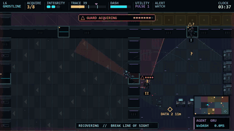

# Ghostline

**A procedural stealth game, and a reinforcement-learning benchmark where the
agent plays by exactly the rules a human does.**

[**▶ Play it in your browser**](https://ghostline-rho.vercel.app) · no install,
no sign-in · press `AGENT TAKEOVER` to hand the same contract to the trained
policy

[](https://github.com/aswanth-07/ghostline/actions/workflows/ci.yml)
[](LICENSE)
[](pyproject.toml)



Steal enough data to satisfy a contract, manage a rising trace signature, and
extract before security closes your route. Six procedurally generated tiers,
cameras, patrolling guards, and late-tier response drones.

---

## The result

A 384-unit recurrent policy, evaluated once on **3,000 contracts it had never
seen**:

| Tier | Success | Wilson 95% | Median time |
|---|---:|---|---:|
| 1 | 99.8% | 98.9 – 100.0 | 13.0 s |
| 2 | 100.0% | 99.2 – 100.0 | 12.7 s |
| 3 | 96.4% | 94.4 – 97.7 | 21.9 s |
| 4 | 98.0% | 96.4 – 98.9 | 23.2 s |
| 5 | 99.0% | 97.7 – 99.6 | 27.9 s |
| 6 | **89.6%** | 86.6 – 92.0 | 31.1 s |

500 episodes per tier. Every episode's seed, action hash, reward decomposition
and failure reason is in
[`benchmarks/neural/champion-final-8m-500.episodes.csv`](benchmarks/neural/champion-final-8m-500.episodes.csv).

**The evaluation could only be run once.** Final-test seeds live in a one-way
ledger: the evaluator takes an exclusive lock, and the slice is marked
`consumed` or `aborted_retired` afterwards with no reopen path. Of the seven
slices in [`benchmarks/final-test-slices.json`](benchmarks/final-test-slices.json),
one carries this result — the other six are retired, including three failed
teacher audits. The failures are published alongside the success.

## What makes it a fair benchmark

The interesting constraint is that **the policy gets no privileged information**.
It reads the same structured observation a player reads off the HUD, the minimap
and the facility telemetry — no hidden enemy coordinates, no renderer-only
state. Human and agent drive the same 60 Hz simulation through the same 36
semantic actions.

That is what makes the two comparable at all, and it is enforced by tests rather
than by intent.

## How it was trained

Behavior cloning from an observation-only teacher, four DAgger recovery rounds
on policy-induced states, then low-rate consolidation — **13,000 updates over
941,884 transitions**.

**PPO was tried and rejected.** A pilot scored a worst-tier 84% against the
matched rollback's 90%. It ships unmodified as
[`ppo-pilot-rejected.json`](benchmarks/neural/ppo-pilot-rejected.json) with
`status: rejected_and_not_resumed`. PPO, GAE and RND are implemented and tested;
the released checkpoint claims no PPO improvement.

The same discipline applied to deployment: dynamic INT8 quantization was 28%
smaller and produced **5 action mismatches in 1,000 recurrent transitions**, so
it was rejected and FP32 ships. That rejection is published too.

## What it does not do

- **Success is not stealth.** Median maximum trace saturates at 100.0 on tiers
  3, 4 and 6 — the policy pins the trace meter and extracts anyway.
- **Routes are competent, not optimal**: path efficiency 0.58–0.79.
- **No superhuman claim.** That needs a matched-seed human cohort, which has not
  been collected.
- The *training* is documented but not fully reproducible from artifacts; the
  *result* is verifiable exactly. See
  [known limitations](wiki/training.md#known-limitations).

## Play it locally

```bash
git clone https://github.com/aswanth-07/ghostline.git
cd ghostline
python -m venv .venv && . .venv/bin/activate    # Windows: .\.venv\Scripts\Activate.ps1
python -m pip install --constraint requirements.lock -e .
ghostline play
```

`WASD` move · `SHIFT` dash · `SPACE` disruption pulse · `ESC` pause.
Touch devices get an on-screen stick.

Watch the trained policy instead:

```bash
python -m pip install --constraint requirements.lock -e ".[agent]"
ghostline lab --tier 6 --seed 2000000
```

## Verify the result yourself

The claim above is checkable in about five minutes, without retraining
anything:

```bash
python -m pip install --constraint requirements.lock -e ".[dev]"
python -m pytest -q                              # 329 tests
python scripts/verify_release_evidence.py        # recomputes the whole result
python scripts/fuzz_ghostline_levels.py --seeds 10000
```

`verify_release_evidence.py` is a recomputation, not a checksum comparison. It
re-derives the environment fingerprint from source, recomputes every per-tier
aggregate and Wilson interval from the raw 3,000 episode records, re-hashes each
output file against the ledger, checks that reward components sum to the
reported total within 1e-9, and loads the ONNX graph to verify its input shapes,
dtypes and metadata. Hand-editing any published number fails it.

## How it fits together

| | |
|---|---|
| `src/ghostline/simulation.py`, `generation.py`, `types.py`, `config.py` | Frozen mechanics. Hashed into the environment fingerprint — editing them invalidates every checkpoint and benchmark. |
| `src/ghostline/env.py`, `env_v1.py` | Gymnasium contract, `Discrete(36)` |
| `src/ghostline/model.py` | Recurrent actor-critic: conv local grid, masked attention over entities, 384-unit GRU |
| `src/ghostline/presentation.py` | 640×360 renderer, native-resolution UI |
| `web/` | Static Pygbag build; the simulation runs in WebAssembly |
| `benchmarks/` | Immutable evidence and the one-way seed ledger |

Deeper detail lives in the [wiki](wiki/index.md):
[architecture](wiki/implementation.md) ·
[training and evaluation](wiki/training.md) ·
[setup and release](wiki/setup.md) ·
[assets](wiki/assets.md) ·
[web deployment](wiki/web-deployment.md)

## A note on the contract name

Immutable artifacts record their observation contract as `GhostlineEnv-v2` while
the public environment id is `GhostlineEnv-v1`. Both name the same environment;
the label is historical. Those artifacts are bound to content hashes, so
rewriting the string inside them would invalidate the evidence it authenticates.

## Asset disclosure

Sprite atlases were AI-assisted and then hand-cleaned; every generation prompt
and retirement decision is recorded in
[`assets/licenses.json`](assets/licenses.json) and [`wiki/assets.md`](wiki/assets.md).
Generated imagery is never collision, navigation, visibility or simulation
truth. Audio is synthesized in-project.

`src/neon_arena/` is a preserved earlier prototype, kept for comparison and
excluded from every distribution.

## License

MIT — see [LICENSE](LICENSE) and [THIRD_PARTY_NOTICES.md](THIRD_PARTY_NOTICES.md).
